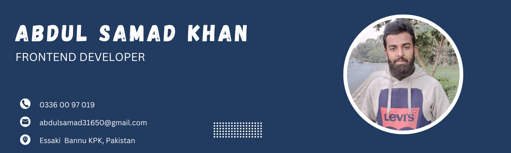

👋 Hello, I'm Abdul Samad Khan, a dedicated front-end developer with two years of freelancing experience on Fiverr. My journey in web programming has equipped me with a solid foundation in HTML, CSS, Bootstrap, and JavaScript. Recently, I've delved into the exciting world of ReactJS, mastering its fundamentals and eager to apply my skills in dynamic web development.

🚀 As a tech enthusiast, I thrive on solving complex problems and creating seamless user experiences. My passion for clean and efficient code reflects in my work, ensuring that every project I undertake meets the highest standards of quality.

💡 I believe in continuous learning and staying ahead of industry trends. The dynamic nature of web development drives me to explore new technologies and push the boundaries of what's possible.

🌐 Currently seeking opportunities to contribute my skills as a ReactJS Developer for a forward-thinking company. If you're looking for someone who combines technical proficiency with a passion for innovation, let's connect! I'm excited about the prospect of collaborating on impactful projects and being a valuable asset to your team.

Let's build the future of web development together! Feel free to reach out for discussions on projects, technology, or anything related to the ever-evolving world of front-end development.
